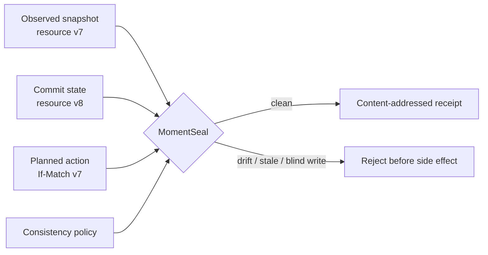

# MomentSeal

**Snapshot-to-commit consistency compiler for AI-agent plans.**

AI agents often decide from a snapshot and act later. In that gap, a ticket changes, an account is revoked, a branch advances, or an earlier tool call invalidates the agent's own evidence. The plan can still look reasonable while its assumptions are no longer true.

MomentSeal compiles the entire plan before execution. It binds observations to resource versions, reconstructs the commit timeline, checks concurrency guards, and rejects actions whose evidence cannot survive until commit.

> Experimental safety tooling. MomentSeal is a deterministic preflight compiler, not a transaction coordinator or an authorization system.

## What it catches

- stale, expired, low-authority, or wrong-resource observations;
- commit-time version drift and predicted `If-Match` failures;
- blind writes, deletes, and external effects without a transaction, lease, or conditional write;
- irreversible actions without recent revalidation;
- evidence invalidated by an earlier action in the same plan;
- competing writes to one version, missing commit snapshots, and create collisions;
- orphan dependencies, invalid order, cycles, and excessive dependency depth.



## Quick start

Requires Node.js 20+ and pnpm.

```bash
corepack enable
pnpm install
pnpm check

pnpm moment demo safe
pnpm moment demo racy
```

The safe example exits `0`. The racy example explains every violation and exits `2`, making it directly usable as a CI or agent-runtime gate.

Compile your own plan:

```bash
pnpm moment init my-agent-plan
pnpm moment compile my-agent-plan/safe-plan.json \
  --policy my-agent-plan/safe-policy.json
```

## CLI

```text
moment-seal inspect <plan.json>
moment-seal compile <plan.json> --policy <policy.json> [--json]
moment-seal explain <plan.json> --policy <policy.json> --action <id>
moment-seal timeline <plan.json> --policy <policy.json> --resource <id>
moment-seal graph <plan.json> --policy <policy.json> [--output graph.dot]
moment-seal receipt <plan.json> --policy <policy.json> --output <receipt.json>
moment-seal verify <receipt.json> --plan <plan.json> --policy <policy.json>
moment-seal demo [safe|racy] [--json]
moment-seal init [directory]
```

Exit codes are stable: `0` clean, `2` blocked, `3` review, `4` invalid receipt, and `5` invalid input or command.

## The model

A plan has three temporal layers:

1. **Observation** — what the agent saw, including version, source, authority, scope, capture time, and expiry.
2. **Commit state** — the resource version captured immediately before execution.
3. **Action** — the intended mutation, expected version, commit time, concurrency mechanism, dependencies, and revalidation.

The policy defines acceptable evidence age, check-to-use gap, authority, revalidation window, and graph depth. The compiler produces per-action decisions, aggregate metrics, a temporal graph, and a deterministic SHA-256 compilation hash.

See [Plan format](docs/PLAN.md), [Policy reference](docs/POLICY.md), and [Runtime integration](docs/INTEGRATION.md).

## Studio

MomentSeal Studio is an interactive temporal workbench for comparing a sealed plan with a racy plan.

```bash
pnpm dev
```

It visualizes observation time, commit-state capture, action time, version drift, conditional coverage, check-to-use gaps, and individual compiler findings. Build it with `pnpm --filter @momentseal/studio build`.

## Receipts

A clean compilation can issue a content-addressed receipt:

```bash
pnpm moment receipt examples/safe-plan.json \
  --policy examples/safe-policy.json \
  --output /tmp/moment-receipt.json

pnpm moment verify /tmp/moment-receipt.json \
  --plan examples/safe-plan.json \
  --policy examples/safe-policy.json
```

Receipts bind the plan, policy, compilation, timestamp, and committed action IDs. They detect later mutation; they are not digital signatures. Sign the receipt with your existing provenance system when producer identity matters.

## Why this matters

Time-of-check to time-of-use is a recognized race-condition class ([MITRE CWE-367](https://cwe.mitre.org/data/definitions/367/)). HTTP `If-Match` exists specifically to prevent lost updates when state changes between retrieval and mutation ([RFC 9110, section 13.1.1](https://www.rfc-editor.org/rfc/rfc9110.html#name-if-match)). Recent research has also examined TOCTOU behavior in LLM agents ([arXiv:2508.17155](https://arxiv.org/abs/2508.17155)).

MomentSeal generalizes those ideas across a multi-action agent plan: not only “did the version change?”, but also “did this plan invalidate its own evidence?”, “is an irreversible action being revalidated close enough to commit?”, and “does every mutation have an enforceable concurrency boundary?”

## Repository layout

```text
packages/core   deterministic compiler, validation, hashing, receipts
packages/cli    automation-friendly command line interface
apps/studio     interactive temporal trace
examples        clean and intentionally racy plans
schemas         JSON Schema contracts
docs            model, policy, integration, and threat boundaries
```

## Project status and originality

MomentSeal is an original experimental implementation of a snapshot-to-commit compiler for whole AI-agent action graphs. An exact public name search was clear on GitHub and npm when the project was created. That is not a legal or global uniqueness guarantee; related concurrency-control and TOCTOU techniques naturally exist.

## Contributing and security

Read [CONTRIBUTING.md](CONTRIBUTING.md) before proposing a new invariant. Report security issues through the process in [SECURITY.md](SECURITY.md). Licensed under [MIT](LICENSE).
